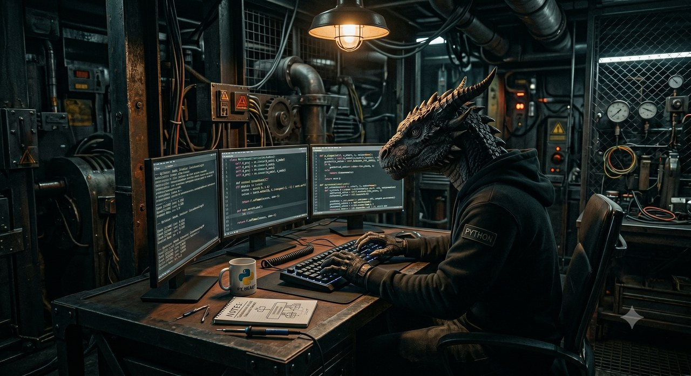

  

  
  
  

---

### 👋 About Me

I'm Ahmet — a third-year **Computer Engineering** student at **Bursa Technical University**, focused on **AI, Machine Learning, and Computer Vision**.

- 🔭 Building **real-time vision systems** — object detection, OCR, and VLM pipelines
- 🧠 Working across the stack: **classical ML** (datathons) → **deep learning** (PyTorch) → **AI engineering**
- 🏆 Datathon competitor & **TEKNOFEST 2026** participant
- ⚡ Currently going deep on **YOLO11**, model deployment, and end-to-end CV systems
- 🥊 Outside of code: boxing

---

### 🛠️ Tech Stack

**Languages & Core**

  

**ML / Computer Vision**

  
  
  
  
  
  
  
  
  
  
  

---

### 📊 GitHub Stats

 

---

### 🐍 Contribution Snake

<picture>
  <source media="(prefers-color-scheme: dark)" srcset="https://raw.githubusercontent.com/ahmetyilmaz-ai/ahmetyilmaz-ai/output/github-contribution-grid-snake-dark.svg" />
  <source media="(prefers-color-scheme: light)" srcset="https://raw.githubusercontent.com/ahmetyilmaz-ai/ahmetyilmaz-ai/output/github-contribution-grid-snake.svg" />
  
</picture>

<!-- OPTIONAL EXTRAS — istersen aşağıdaki yorum satırlarını açıp ekleyebilirsin

-->

---

### 🤝 Connect

⚡ Always learning, always building.

